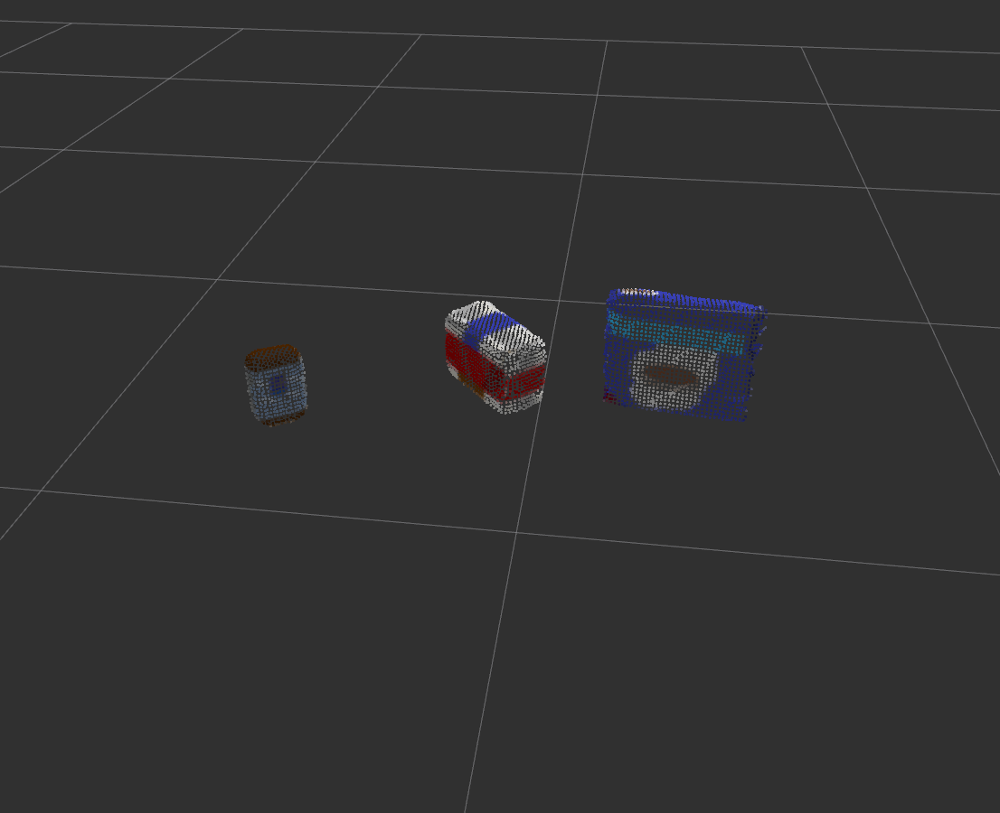
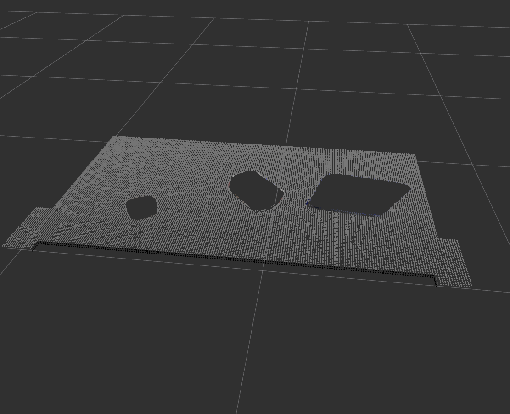
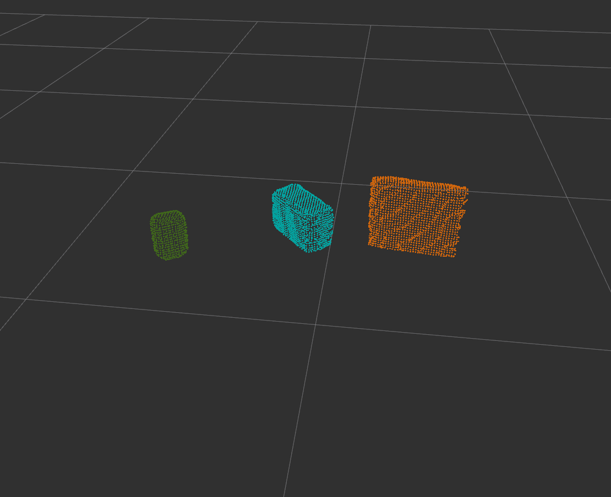
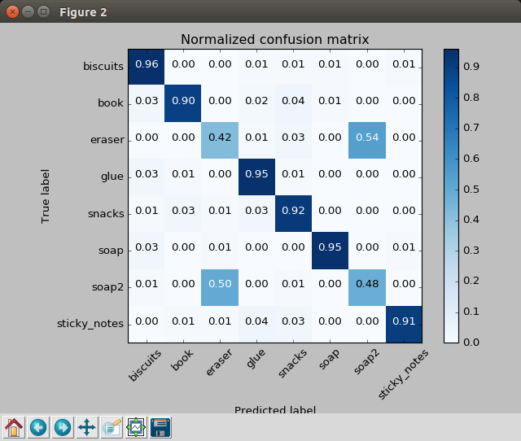
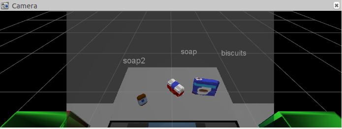
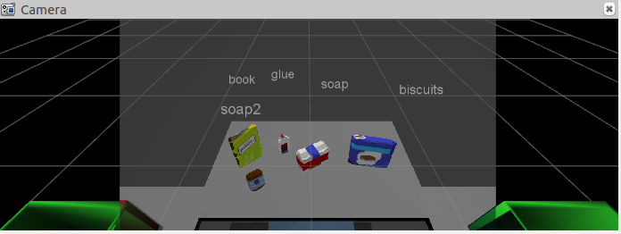
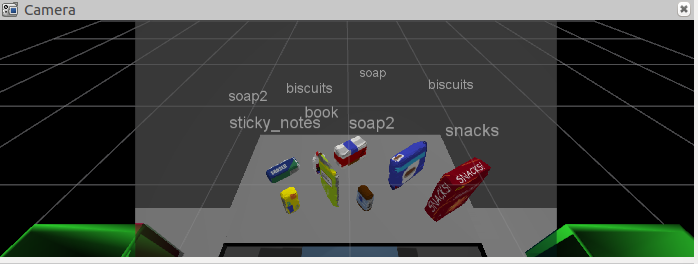

## Project: Perception Pick & Place
### Writeup Template: You can use this file as a template for your writeup if you want to submit it as a markdown file, but feel free to use some other method and submit a pdf if you prefer.

---

---
### Writeup / README

#### 1. Provide a Writeup / README that includes all the rubric points and how you addressed each one.

You're reading it!

### Exercise 1, 2 and 3 pipeline implemented

[A link to my Pipeline Script](https://github.com/cedricxie/RoboND-Perception-Project/blob/master/src/perception/pr2_robot/scripts/object_recognition.py)

The overall pipeline for perception in my model is as follows:

#### Step 1
* Filter out Noise
* PassThrough Filter
* RANSAC Plane Segmentation
* Extract inliers and outliers




#### Step 2
* Euclidean Clustering
* Create a cluster extraction object
* Create new cloud containing all clusters, each with unique color



#### Step 3
* Extract histogram features
* Make the prediction, retrieve the label for the result
* Publish a label into RViz
* Add the detected object to the list of detected objects.

Here are the settings I used to create my SVM:
1. Number of random orientation for each object: 100
2. Bins (Color & Normals): 64
3. RGB vs HST: HST
4. Total Features: 800

Here's the output of the training. Notice that it looks like the SVM classifier is having a difficult time distinguishing between eraser and soap2.




### Pick and Place Setup

#### 1. For all three tabletop setups (`test*.world`), perform object recognition, then read in respective pick list (`pick_list_*.yaml`). Next construct the messages that would comprise a valid `PickPlace` request output them to `.yaml` format.

- World 1

All 3 objects are classified successfully.

```
[INFO] [1505260632.503903, 997.250000]: Detected 3 objects: ['biscuits', 'soap', 'soap2']
[INFO] [1505260632.505661, 997.251000]: Starting pr2_mover with 3 objects
[INFO] [1505260632.526745, 997.258000]: Successfully output 3 objects to yaml file
```


Output YAML file
[Test Scene 1](https://github.com/cedricxie/RoboND-Perception-Project/blob/master/output_1.yaml)

- World 2

All 5 objects are classified successfully.

```
[INFO] [1505260286.962225, 1107.847000]: Detected 5 objects: ['biscuits', 'book', 'soap', 'soap2', 'glue']
[INFO] [1505260286.964570, 1107.848000]: Starting pr2_mover with 5 objects
[INFO] [1505260287.005873, 1107.859000]: Successfully output 5 objects to yaml file
```


Output YAML file
[Test Scene 2](https://github.com/cedricxie/RoboND-Perception-Project/blob/master/output_2.yaml)

- World 3

5 out of 8 objects are classified successfully.

```
[INFO] [1505260464.245457, 1321.253000]: Detected 8 objects: ['snacks', 'biscuits', 'book', 'soap', 'soap2', 'soap2', 'sticky_notes', 'biscuits']
[INFO] [1505260464.248257, 1321.254000]: Starting pr2_mover with 8 objects
[INFO] [1505260464.267704, 1321.258000]: Can't Find Object: eraser
[INFO] [1505260464.276326, 1321.258000]: Can't Find Object: glue
```



Output YAML file
[Test Scene 3](https://github.com/cedricxie/RoboND-Perception-Project/blob/master/output_3.yaml)

#### Discussion
The challenge here is that the SVM classifier is not very successful in distinguishing small objects such as eraser, glue and soap. I might have to increase the number of training samples. Or there might be something that is missing in the pre-processing step. I will have to dig it out later.
In addition, my model would fail to work when
- If the orientation of the camera changes
- If more noise is introduced into the scene

Lots of work to be done!
